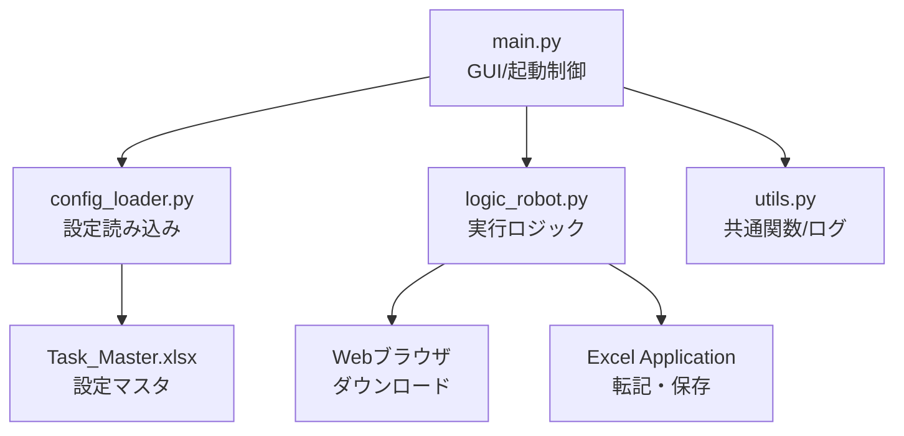

# Co-worker Bot システム仕様書

## 1. システム概要
本システム「Co-worker Bot」は、Windows環境における定型業務（WebシステムからのCSVデータダウンロードおよびExcel帳票への転記作業）を自動化するためのRPAツールである。
PythonとWin32 API（COM）を利用して構築され、GUIによる操作とバックグラウンドでの自動実行を提供する。

## 2. 動作環境
- **OS**: Windows 10/11
- **依存ランタイム**: Python 3.10以上
- **必須アプリケーション**: Microsoft Excel (Desktop版)
- **ネットワーク**: 業務対象のWebサイトにアクセス可能な環境

## 3. システム構成

### 3-1. モジュール構成


### 3-2. ディレクトリ構成
```text
Root/
├── src/                # ソースコード
├── settings/           # 設定ファイル
│   ├── production/     # 本番用設定
│   └── test/           # テスト用設定
├── logs/               # 実行ログ（日別）
├── docs/               # ドキュメント類
└── Co-worker_Bot.exe   # 実行ファイル（ビルド後）
```

## 4. 機能仕様

### 4-1. 起動・環境切り替え機能
- **通常起動**: 本番用設定 (`settings/production/Task_Master.xlsx`) を読み込む。
- **テスト起動**: 引数 `--env=test` を指定することで、テスト用設定 (`settings/test/Task_Master.xlsx`) を読み込む。
- **起動時チェック**:
    - ブラウザ（デフォルトブラウザ）を自動起動し、ログイン状態の確認を促す。
    - クリップボード操作禁止の警告ポップアップを表示する。

### 4-2. タスク実行機能
- **グループ実行**: 設定された「グループ」単位で、開始時刻順にタスクを順次実行する。
- **実行判定**:
    - `Active` フラグが TRUE のもののみ実行。
    - `StartTime` ～ `EndTime` の範囲内である場合のみ実行。範囲外の場合はスキップ（ログ記録）。
- **フロー**:
    1.  指定URLをブラウザで開く（ダウンロード開始）。
    2.  `Downloads` フォルダを監視し、`SearchKey` に一致する最新CSVファイルを特定。
    3.  Excel (`FilePath`) を起動・オープン。
    4.  CSVデータを `TargetSheet` に値貼り付け。
    5.  `ActionAfter` 設定に従い、保存(Save) または 一時停止(Pause) を行う。
- **実行一時停止**:
    - 「一時停止」ボタンにより、現在のタスク完了後に待機状態へ移行する。
    - 待機中はWindowsロックが可能。再開ボタンにより次タスクへ進む。

### 4-3. やり直し（リカバリ）機能
- **タスク指定実行**: GUI上のリストから任意のタスクを選択可能。
- **ここから実行**: 選択したタスク以降の、**同一グループ内のタスク**を順次実行する。
- **このタスクのみ**: 選択したタスク単体を実行する。
- ※リカバリ実行時は、時刻制限 (`StartTime`/`EndTime`) を無視して強制実行される。

## 5. データ仕様 (Task_Master.xlsx)

`TaskList` シートにて動作定義を行う。

### 5-1. 設定項目
**Config (from Task_Master.xlsx)**
- **Active** (`Active`): `TRUE`: 有効, `FALSE`: 無効
- **グループ** (`Group`): Group name for batch execution
- **メモ** (`Memo`): Remarks (no system impact)
- **開始時刻** (`StartTime`): Execution start time (HH:MM)
- **終了時刻** (`EndTime`): Execution end time (HH:MM)
- **ファイルパス** (`FilePath`): Path to target Excel file
- **転記シート** (`TargetSheet`): Destination sheet name
- **ダウンロードURL** (`DownloadURL`): Source URL for CSV
- **検索キー** (`SearchKey`): Keyword to find downloaded CSV
- **完了後動作** (`ActionAfter`): 'Save' or 'Pause'
- **終了後閉じる** (`CloseAfter`): Close Excel after task completion
- **DLスキップ** (`SkipDownload`): Skip download process
- **マクロ名** (`MacroName`): VBA macro to run before saving

## 6. エラーハンドリング・ログ
- **ログ出力**: `logs/log_YYYYMMDD.txt` に日次で出力。
    - レベル: INFO, ERROR, WARNING, SUCCESS, SKIP
- **例外処理**:
    - Webサイト接続エラー、ファイル不在、Excel操作エラー等はキャッチされ、エラーログを出力して次のタスクへ移行する（異常終了しない）。
    - 致命的なエラー（設定ファイル読み込み不可など）の場合のみ、ダイアログ表示後に終了する。

## 7. 制限事項
- **ブラウザセッション**: 自動ログイン機能は有しない。実行前にユーザーによるログインが必要。
- **クリップボード**: Excel操作にクリップボードを使用するため、実行中の他PC操作（コピペ）は禁止。
- **Excelライセンス**: 実行環境にてExcelがライセンス認証済みであり、起動時にポップアップが出ない状態であること。
