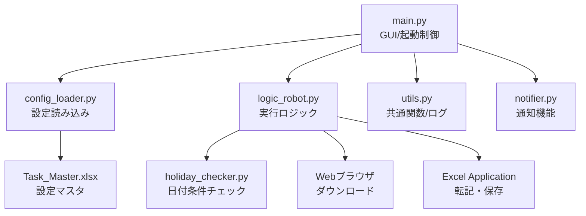

# Co-worker Bot システム仕様書

## 1. システム概要
本システム「Co-worker Bot」は、Windows環境における定型業務（WebシステムからのCSVデータダウンロードおよびExcel帳票への転記作業）を自動化するためのRPAツールである。
PythonとWin32 API（COM）を利用して構築され、GUIによる操作とバックグラウンドでの自動実行を提供する。

## 2. 動作環境
- **OS**: Windows 10/11
- **依存ランタイム**: Python 3.10以上
- **必須アプリケーション**: Microsoft Excel (Desktop版)
- **ネットワーク**: 業務対象のWebサイトにアクセス可能な環境
- **オプション**: `jpholiday` パッケージ（祝日スキップ機能使用時）

## 3. システム構成

### 3-1. モジュール構成


### 3-2. ディレクトリ構成
```text
Root/
├── src/                # ソースコード
├── settings/           # 設定ファイル
│   ├── production/     # 本番用設定
│   └── test/           # テスト用設定
├── logs/               # 実行ログ（日別）
├── docs/               # ドキュメント類
└── Co-worker_Bot.exe   # 実行ファイル（ビルド後）
```

## 4. 機能仕様

### 4-1. 起動・環境切り替え機能
- **通常起動**: 本番用設定 (`settings/production/Task_Master.xlsx`) を読み込む。
- **テスト起動**: 引数 `--env=test` を指定することで、テスト用設定を読み込む。
- **起動時チェック**:
    - ブラウザ（デフォルトブラウザ）を自動起動し、ログイン状態の確認を促す。
    - クリップボード操作禁止の警告ポップアップを表示する。
    - **設定バリデーション**: タスク設定の問題（ファイル不在、URL空欄等）を検出し警告表示。

### 4-2. タスク実行機能
- **グループ実行**: 設定された「グループ」単位で、開始時刻順にタスクを順次実行する。
- **タスク最適化**: 同一ファイルを使用するタスクは連続配置され、ファイル開閉回数を最小化。
- **実行判定**:
    - `Active` フラグが TRUE のもののみ実行。
    - `StartTime` ～ `EndTime` の範囲内である場合のみ実行。範囲外の場合はスキップ。
    - **条件付き実行**: 曜日・祝日・日付条件による自動スキップ。
- **フロー**:
    1. 条件チェック（曜日・祝日・日付）→ 不一致ならスキップ
    2. 指定URLをブラウザで開く（ダウンロード開始）。
    3. `Downloads` フォルダを監視し、CSVファイルを特定。**失敗時は最大3回リトライ**。
    4. Excel (`FilePath`) を起動・オープン。
    5. CSVデータを `TargetSheet` に値貼り付け。
    6. `ActionAfter` 設定に従い、保存(Save) または 一時停止(Pause) を行う。
- **完了通知**: タスク完了時にWindows トースト通知を表示。

### 4-3. やり直し（リカバリ）機能
- **タスク指定実行**: GUI上のリストから任意のタスクを選択可能。
- **ここから実行**: 選択したタスク以降の、同一グループ内のタスクを順次実行する。
- **このタスクのみ**: 選択したタスク単体を実行する。
- **右クリックメニュー**: グループボタンを右クリックで「強制実行」オプション選択可能。

### 4-4. GUI機能
- **ダークモード**: メニュー「表示」→「ダークモード」で切り替え可能。
- **ログフィルタ**: 履歴エリアで「全て/成功/エラー/スキップ」でフィルタリング。
- **右クリックメニュー**: グループボタンで通常実行/強制実行/設定ファイルを開く。
- **CSV削除確認スキップ**: セッション中の確認をスキップするオプション。

## 5. データ仕様 (Task_Master.xlsx)

`TaskList` シートにて動作定義を行う。

### 5-1. 基本設定項目
| 項目名 | 列名 | 説明 |
|--------|------|------|
| Active | 有効 | TRUE: 有効, FALSE: 無効 |
| Group | グループ | グループ名（実行単位） |
| StartTime | 開始時刻 | 実行開始時刻 (HH:MM) |
| EndTime | 終了時刻 | 実行終了時刻 (HH:MM) |
| FilePath | ファイルパス | 対象Excelファイルのパス |
| TargetSheet | CSV転記シート | 転記先シート名 |
| DownloadURL | ダウンロードURL | CSVダウンロードURL |
| ActionAfter | 完了後動作 | 'Save' or 'Pause' |
| CloseAfter | 終了後閉じる | タスク完了後にExcelを閉じる |
| SkipDownload | DLスキップ | ダウンロード処理をスキップ |
| MacroName | マクロ名 | 保存前に実行するVBAマクロ |

### 5-2. 条件付き実行設定（新機能）
| 項目名 | 列名 | 説明 | 例 |
|--------|------|------|-----|
| Weekdays | 曜日 | 実行する曜日 (1=月〜7=日) | `1,2,3,4,5` (平日のみ) |
| SkipHoliday | 祝日スキップ | 日本の祝日をスキップ | `TRUE` |
| DateCondition | 日付条件 | 実行する日 | `1,15,L` (1日・15日・月末) |

## 6. エラーハンドリング・ログ
- **ログ出力**: `logs/log_YYYYMMDD.txt` に日次で出力。
    - レベル: INFO, ERROR, WARNING, SUCCESS, SKIP
- **自動リトライ**: ダウンロード失敗時は最大3回リトライ（5秒間隔）。
- **例外処理**:
    - Webサイト接続エラー、ファイル不在、Excel操作エラー等は次のタスクへ移行。
    - 致命的なエラーの場合のみ、ダイアログ表示後に終了する。

## 7. 制限事項
- **ブラウザセッション**: 自動ログイン機能は有しない。実行前にユーザーによるログインが必要。
- **クリップボード**: Excel操作にクリップボードを使用するため、実行中の他PC操作（コピペ）は禁止。
- **Excelライセンス**: 実行環境にてExcelがライセンス認証済みであること。
- **祝日チェック**: `jpholiday` パッケージ未インストール時は祝日スキップ機能は無効。

