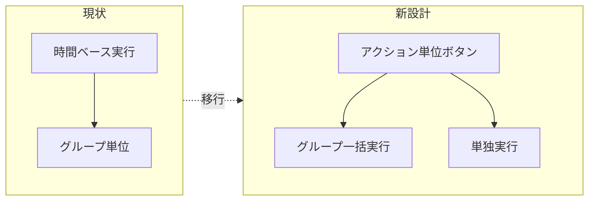
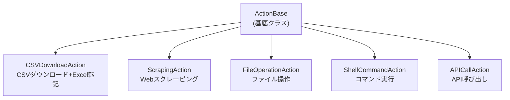
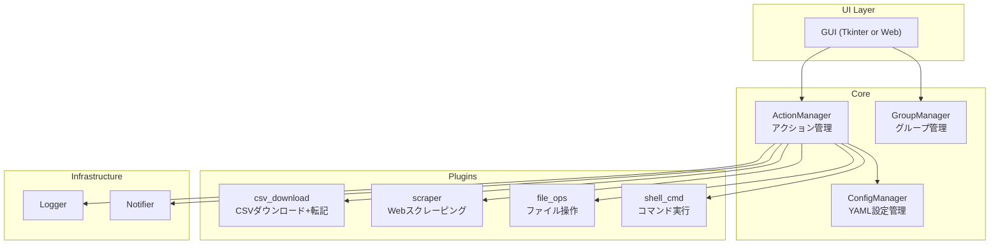

# kai_system リアーキテクチャ設計提案書

## 現状の分析

現在の **Co-worker Bot** は以下の特性を持つ Windows RPA ツール:

| 項目 | 現状 |
|---|---|
| GUI | Tkinter (550x650 固定) |
| 設定 | Excel (`Task_Master.xlsx`) |
| スケジュール | `StartTime` / `EndTime` による時間帯実行 |
| タスク | CSV ダウンロード → Excel 転記 のみ |
| OS依存 | Windows 専用 (win32com, ctypes) |

> [!IMPORTANT]
> 以下の設計方針についてだいすけさんのフィードバックをお願いします。
> 特に「どの機能が最優先か」「スクレーピング対象の具体例」があれば教えてください。

---

## 設計方針: 3つの柱

### 1. スケジュール性の撤廃 → アクション駆動型へ



- `StartTime` / `EndTime` を完全撤廃
- 各タスク（アクション）を個別のボタンとして表示
- グループは「まとめて実行」用のラベルとして残す
- 時間グループ化（表示用の区切り）はオプションで残す

### 2. プラグイン型アクションシステム

現在は「CSV ダウンロード → Excel 転記」のみだが、**アクションをプラグイン化**して拡張可能に:



### 3. 設定の YAML 化

Excel (`Task_Master.xlsx`) から **YAML** ベースへ移行:
- 人間が読みやすい
- Git 管理しやすい
- Excel が不要になる（ランタイム依存軽減）

---

## 新機能提案一覧

### コア機能

| # | 機能 | 説明 | 優先度 |
|---|------|------|--------|
| 1 | **アクションボタン化** | 登録済みタスクを個別ボタンで表示・実行 | ★★★ |
| 2 | **グループ一括実行** | グループ単位でまとめてボタン1つで実行 | ★★★ |
| 3 | **YAML 設定** | Excel → YAML 移行。手軽に編集・Git管理 | ★★★ |
| 4 | **プラグイン型アクション** | 新しい種類のアクションを簡単に追加可能 | ★★☆ |

### スクレーピング関連

| # | 機能 | 説明 | 優先度 |
|---|------|------|--------|
| 5 | **簡易スクレーピング** | URL + CSSセレクタ指定でテーブルデータ取得 | ★★★ |
| 6 | **スクレーピングテンプレート** | よく使うパターンをテンプレ化して再利用 | ★★☆ |
| 7 | **定期スクレーピング** | cron的に自動実行（オプション） | ★☆☆ |
| 8 | **スクレーピング結果プレビュー** | 取得データをGUI上でプレビュー表示 | ★★☆ |

### UI/UX 改善

| # | 機能 | 説明 | 優先度 |
|---|------|------|--------|
| 9 | **Web UI (Flask/FastAPI)** | Tkinter → Web化でクロスプラットフォーム対応 | ★★☆ |
| 10 | **ドラッグ&ドロップ並び替え** | ボタンの順番をD&Dで変更 | ★☆☆ |
| 11 | **実行履歴ダッシュボード** | 過去の実行結果を統計表示 | ★☆☆ |
| 12 | **通知統合** | Slack / Discord / LINE 通知 | ★☆☆ |

---

## 新アーキテクチャ



### 新ディレクトリ構成

```text
kai_system/
├── src/
│   ├── core/
│   │   ├── action_base.py      # アクション基底クラス
│   │   ├── action_manager.py   # アクション管理・実行
│   │   ├── group_manager.py    # グループ管理
│   │   └── config_manager.py   # YAML設定読み込み
│   ├── actions/                # プラグインアクション
│   │   ├── csv_download.py     # CSV DL + Excel転記（既存ロジック）
│   │   ├── scraper.py          # Webスクレーピング
│   │   ├── file_ops.py         # ファイル操作
│   │   └── shell_cmd.py        # シェルコマンド実行
│   ├── gui/
│   │   ├── main_window.py      # メインウィンドウ
│   │   ├── action_panel.py     # アクションボタンパネル
│   │   └── history_panel.py    # 履歴表示パネル
│   ├── infra/
│   │   ├── logger.py           # ログ
│   │   └── notifier.py         # 通知
│   └── main.py                 # エントリーポイント
├── config/
│   ├── actions.yaml            # アクション定義
│   └── groups.yaml             # グループ定義
├── templates/                  # スクレーピングテンプレート
├── tests/
├── docs/
└── logs/
```

### YAML 設定例

**config/actions.yaml**
```yaml
actions:
  - id: sales_report
    name: 売上レポート取得
    type: csv_download        # プラグイン名
    group: 午前業務
    params:
      url: "https://example.com/export/sales.csv"
      excel_path: "C:/Reports/売上データ.xlsx"
      target_sheet: "データ"
      action_after: save
      
  - id: inventory_scrape
    name: 在庫データスクレイピング
    type: scraper
    group: 午前業務
    params:
      url: "https://example.com/inventory"
      selector: "table.inventory-table"
      output: "C:/Reports/在庫管理.xlsx"
      output_sheet: "データ"
      
  - id: daily_backup
    name: 日次バックアップ
    type: shell_cmd
    group: 夕方業務
    params:
      command: "robocopy C:\\Data D:\\Backup /MIR"
```

**config/groups.yaml**
```yaml
groups:
  - name: 午前業務
    display_order: 1
    color: "#4CAF50"
    
  - name: 午後業務
    display_order: 2
    color: "#2196F3"
    
  - name: 夕方業務
    display_order: 3
    color: "#FF9800"
```

### スクレーピング機能の設計

「手軽にしたい」という要望に応えるため、**3段階の簡易度**を用意:

| レベル | 方法 | 用途 |
|--------|------|------|
| Level 1 | URL + テーブル自動検出 | `<table>` タグのあるページ |
| Level 2 | URL + CSS セレクタ指定 | 特定要素を指定して取得 |
| Level 3 | カスタムスクリプト | 複雑なページ(JS描画等) |

**Level 1 の使い方（最もシンプル）:**
```yaml
- id: price_check
  name: 価格チェック
  type: scraper
  params:
    url: "https://example.com/prices"
    mode: auto_table           # テーブル自動検出
    table_index: 0             # 最初のテーブル
    output: "prices.xlsx"
```

**Level 2 の使い方:**
```yaml
- id: news_scrape
  name: ニュース取得
  type: scraper
  params:
    url: "https://example.com/news"
    mode: css_selector
    selectors:
      title: "h2.article-title"
      date: "span.date"
      content: "div.article-body"
    output: "news.xlsx"
```

**使用ライブラリ候補:**
- `requests` + `BeautifulSoup4` (静的ページ)
- `playwright` or `selenium` (動的ページ、JS描画)
- `pandas.read_html()` (テーブル自動検出のショートカット)

---

## 実装フェーズ計画

### Phase 1: コアリファクタリング（最優先）
- YAML 設定システム構築
- ActionBase 基底クラス作成
- 既存 CSV ダウンロード機能を ActionPlugin化
- GUI をアクションボタン表示に変更

### Phase 2: スクレーピング機能
- ScrapingAction プラグイン実装
- Level 1 (auto_table) 対応
- Level 2 (css_selector) 対応
- 結果プレビュー

### Phase 3: 拡張機能
- ShellCommandAction
- FileOperationAction
- 通知統合 (Slack等)

### Phase 4: UI/UX 強化
- Web UI 化の検討
- ダッシュボード
- テンプレート管理

---

## 確認したいポイント

1. **GUI**: Tkinter を維持する？ それとも Web UI (ブラウザベース) に移行する？
2. **OS対応**: Windows 専用のまま？ macOS でも動かしたい？
3. **スクレーピング対象**: 具体的にどんなサイト/データを取りたい？（認証が必要？JS描画？）
4. **Excel依存**: Excel COM操作は維持する必要がある？（openpyxl での書き込みに置換可能？）
5. **Phase 1 から始めて良い？**: 段階的に進めるか、一気にやるか？
